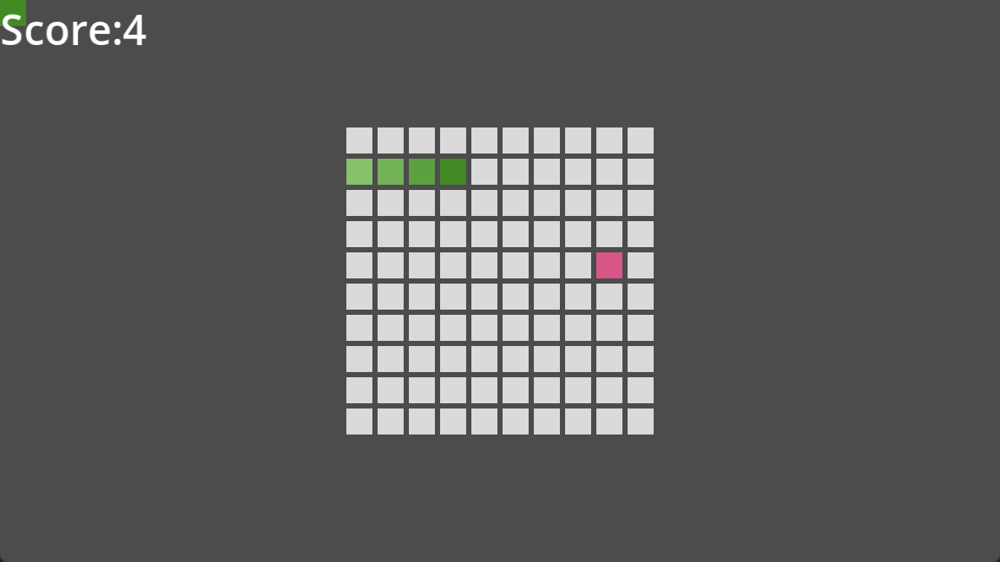

# Godot_SimpleDemo
A simple game collection which is builded by godot and c#

The game use the C# and IOC.I will try to use the simple ui to build the classic old game for learning the godot engine.And for increasing the English skill,I will use the English as my first language.

# project show

## snake

The snake imitation is builded for learning the godot ui editor. In the project,I use the colorReact to show the snake move and score game.
I using the second-order array to show the snake moving replace the physics collsion.

## tetris
Teris is a very classic game in the world.The traditional form of expression is move by cell which will make the graphics kartun.For learning the godot physics system,I will try to add physics element in the simple godot game.

